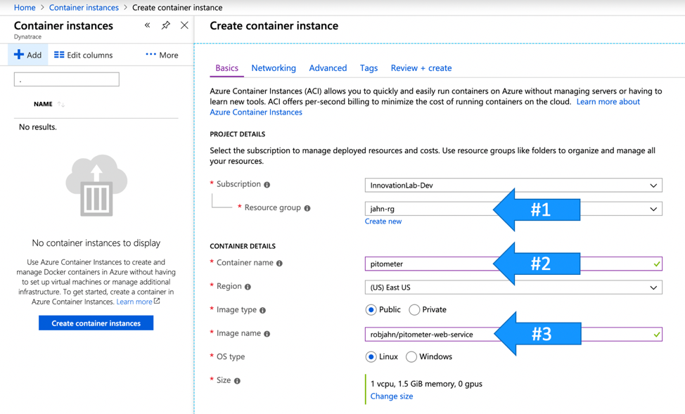
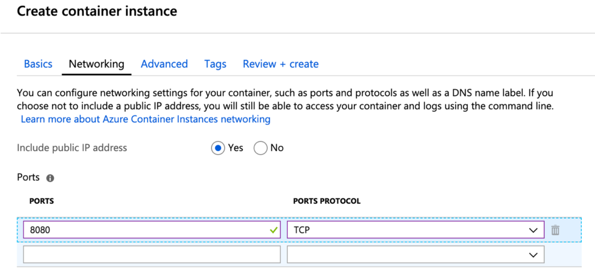
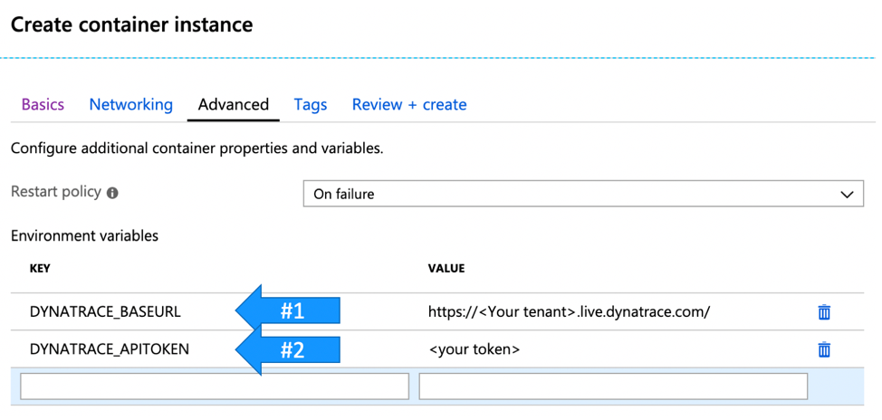
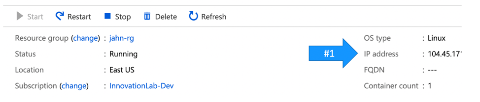
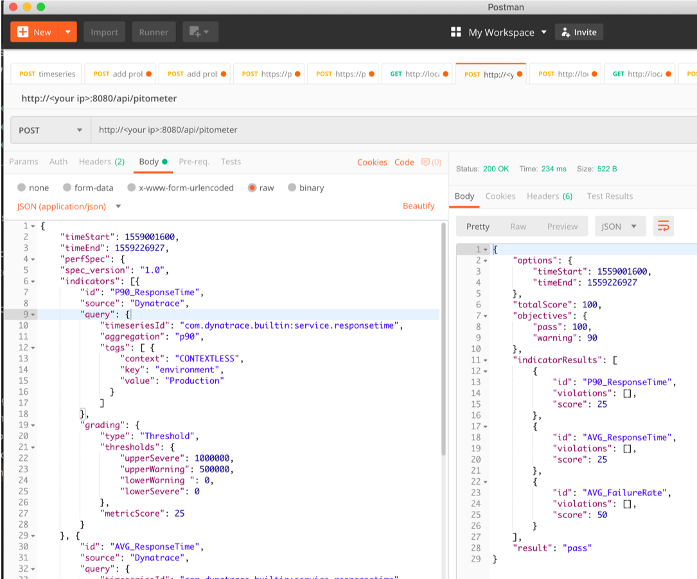

# :rotating_light: This project was based on Keptn Pitometer that was deprecated with Keptn version 0.6.0. Please reach out to the Keptn team using Slack, a GitHub issue, or any other way you prefer to learn about the transition from Pitometer to the new [Lighthouse-Service](https://github.com/keptn/keptn/tree/develop/lighthouse-service). You can find new sandbox projects in the [keptn-sandbox org](https://github.com/keptn-sandbox) :rotating_light:

# Overview

Microservice web application that provides the processing logic of a passed in "perf spec" and start/end time frame. This service can be used as a software quality gate within continuous integration software pipelines. 

The "perf spec" processing logic uses the [Keptn Pitometer NodeJS modules](https://github.com/keptn/pitometer). This web application uses these specific modules.
* [pitometer](https://github.com/keptn/pitometer) - Core module that acts as monspec processor to the request
* [source-dynatrace](https://github.com/keptn/pitometer-source-dynatrace) - interfaces to Dynatrace API to collect metrics
* [grader-thresholds](https://github.com/keptn/pitometer-grader-thresholds) - evaluates the threasholds and scores the request

Read how to incorporate in these blogs:
* [Adding automated performance quality gates using keptn pitometer](https://cloudblogs.microsoft.com/opensource/2019/04/25/adding-automated-performance-quality-gates-using-keptn-pitometer/)
* [Five steps to add automated performance quality gates to Azure DevOps pipelines](https://cloudblogs.microsoft.com/opensource/2019/06/11/five-steps-add-automated-performance-quality-gates-azure-devops-pipelines/)

# Interface design

## Request - healthpage

* GET request to http://[baseurl]/health will return status it service is running
```
{
    "status": "UP"
}
```

## Request - Perf Spec evaluation
* POST request to https://[baseurl]/api/pitometer
* Content-Type: application/json
* Body Structure
  * timeStart - start time in [UTC unix seconds format](https://cloud.google.com/dataprep/docs/html/UNIXTIME-Function_57344718) used for the query
  * timeEnd - end time in [UTC unix seconds format](https://cloud.google.com/dataprep/docs/html/UNIXTIME-Function_57344718) used for the query
  * perfSpec - a JSON structure containing the performance signature
    * spec_version - string property with pitometer version.  Use 1.0
    * indicator - array of each indicator objects
    * objectives - object with pass and warning properties
    * <details><summary>Body Structure Format</summary>

        ```
        {
            "timeStart": 1551398400,
            "timeEnd": 1555027200,
            "perfSpec": {
                "spec_version": "1.0",
                "indicators": [ { <Indicator object 1> } ],
                "objectives": {
                    "pass": 100,
                    "warning": 50
                }
            }
        }
        ```

        </details>

    * [Complete Body example](samples/pitometer.rest)


## Response of valid lookup

A valid response will return an HTTP 200 with a JSON body containing these properties:
* totalScore - numeric property with the sum of the passsing indicator metricScores
* objectives - object with pass and warning properties passed in from the request
* indicatorResults - array of each indicator and their specific scores and values
* result - string property with value of 'pass', 'warn' or 'warning'

<details><summary>
Example response message
</summary>

```
{
    "totalScore": 60,
    "objectives": {
        "pass": 100,
        "warning": 50
    },
    "indicatorResults": [
        {
            "id": "P90_ResponseTime_Frontend",
            "violations": [
                {
                    "value": 5824401.800000001,
                    "key": "SERVICE-BAB018A09DA36B75",
                    "breach": "upper_critical",
                    "threshold": 4000000
                }
            ],
            "score": 20
        },
        {
            "id": "AVG_ResponseTime_Frontend",
            "violations": [
                {
                    "value": 2476689.888888889,
                    "key": "SERVICE-BAB018A09DA36B75",
                    "breach": "upper_warning",
                    "threshold": 2000000
                }
            ],
            "score": 40
        }
    ],
    "result": "warning"
}
```

</details>

## Example response of invalid arguments

A valid response will return an HTTP 400 with a JSON body containing these properties:
* result - string property with value of 'error'
* message - string property with error messsage

<details><summary>
Example response message
</summary>

```
{
  "status": "error",
  "message": "Missing timeStart. Please check your request body and try again."
}
```
</details>

## Example response of processing error

A valid response will return an HTTP 500 with a JSON body containing these properties:
* result - string property with value of 'error'
* message - string property with error messsage

<details><summary>
Example response message
</summary>

```
{
  "status": "error",
  "message": "The given timeseries id is not configured."
}
```
</details>

# Run the app from Docker

You can just pull a pre-built image from [docker hub](https://hub.docker.com/r/robjahn/pitometer-web-service)

1. Start a docker a container with the environment variables for the Dyntrace configuration.  The web application will be listening on port 8080
    * option 1: explicitly passing in values
        ```
        docker run -p 8080:8080 -d -e DYNATRACE_BASEURL=<dynatrace tenant url> -e DYNATRACE_APITOKEN=<dynatrace api token> robjahn/pitometer-web-service
        ```
    * option 2: set OS variables
        ```
        export DYNATRACE_BASEURL=<dynatrace tenant url, example: https://abc.live.dynatrace.com>

        export DYNATRACE_APITOKEN=<dynatrace API token>

        docker run -p 8080:8080 -d -e DYNATRACE_BASEURL=$DYNATRACE_BASEURL -e DYNATRACE_APITOKEN=$DYNATRACE_APITOKEN robjahn/pitometer-web-service
        ```
1. make post request using a tool like [Postman](https://www.getpostman.com/downloads/) or the [VS Code REST client](https://marketplace.visualstudio.com/items?itemName=humao.rest-client) and the [Complete Body example](samples/pitometer.rest)

# Use Azure container instance to host the pitometer web service

The quickest way to setup the Pitometer webservice in Azure is to start up an Azure container instance that uses the pre-built [Pitometer webservice image](https://hub.docker.com/r/robjahn/pitometer-web-service). This way any pipeline can add a quality gate by just calling webservice with their 'PerfSpec' file.

## Option 1 - Use Azure Portal

Login into the Azure portal and create a new container instance with the inputs shown below:
1. Container instance name 
2. New or existing resource group
3. Container image name of “robjahn/pitometer-web-service”



Next, click on the 'Networking' tab adjust from port 80 to port 8080.



Next, click on the “Advanced” Tab and add these environment variables that are used to configure “Pitometer” to call the Dynatrace API for your Dynatrace environment.
* DYNATRACE_BASEURL – the base URL of your Dynatrace account
* DYNATRACE_APITOKEN – the [Dynatrace API token](https://www.dynatrace.com/support/doc/nam/rum-console-and-configuration/rum-console-home/settings-menu-section/menu-settings-security/api-tokens/) 

This is how it should look:



Finally, review and create the container instance.

After the container instance is running, go to the overview page as shown below and use the IP address within the URL to the Pitometer endpoint:  ```http://<Your IP>:8080/api/pitometer```



## Option 2 - Use azure CLI

Alternatively, here are the commands to automate this provisioning process using the [Azure CLI](https://docs.microsoft.com/en-us/cli/azure/install-azure-cli?view=azure-cli-latest) on can quickly start up a [Azure container instance](https://azure.microsoft.com/en-us/services/container-instances/) that uses the pre-built image.  Below are the commands to create and delete a container instance using the pre-built image.

```
# Create a resource group and container instance.  Replace with you Dynatrace values.  Replace with your intance name and resource group.

az group create --name keptn-pitometer-group --location eastus

az container create \
    --resource-group keptn-pitometer-group \
    --name pitometer-web-service \
    --image robjahn/pitometer-web-service \
    --restart-policy OnFailure \
    --ip-address public \
    --ports 8080 \
    --environment-variables 'DYNATRACE_BASEURL'='https://ABCD.live.dynatrace.com' 'DYNATRACE_APITOKEN'='YOUR API TOKEN'

# Remove the container instance. Replace with your intance name and resource group.
az container delete \
    --resource-group keptn-pitometer-group \
    --name pitometer-web-service

```

# Use Cloud Foundry to host the pitometer web service

In this repo is a cloud foundry manifest example file that you can use to run the service.

1. adjust the environment values in ```manifest.yaml``` for your Dynatrace URL and Token.
```
DYNATRACE_BASEURL: Example https://yourtenant.live.dynatrace.com
DYNATRACE_APITOKEN: Your APIToken value
```

2. deploy the application with optional name using this command
```
cf push <appname> -f manifest.yml
```
 
See [Cloud Foundry Docs](https://docs.cloudfoundry.org/devguide/deploy-apps/manifest.html) for additional options

# Use Postman to validate

A client tool such as [Postman](https://www.getpostman.com/) is an easy way to test the service.  Just create a POST request with this information as seen below.
* URL = http://[Your IP]:8080/api/pitometer
* Content-Type = application/json



# Build your own Docker image

This repo has a [Dockerfile](Dockerfile) to build the application.  

To build and run a container locally:
1. You must have [docker](https://runnable.com/docker/) installed 
1. run this command to build an image 
    ```
    # this example assuming public dockerhub register format
    docker build -t <account/pitometer-web-service> .

    # optional push image to registry
    docker push account/pitometer-web-service
    ```
3. follow steps above in the section 'Run the app from Docker'

# Local development

1. You must have [node](https://nodejs.org/en/download/) installed locally.
1. Once you clone the repo, you need to run ```npm install``` to download the required modules
1. Confugure these environment variables
  * option 1: set environment variables in the shell
    ```
    export DYNATRACE_BASEURL=<dynatrace tenant url, example: https://abc.live.dynatrace.com>

    export DYNATRACE_APITOKEN=<dynatrace API token>
    ```
  * option 2: make a ```.env``` file in the root project folder wit these values
    ```
    DYNATRACE_BASEURL=<dynatrace tenant url, example: https://abc.live.dynatrace.com> 
    DYNATRACE_APITOKEN=<dynatrace API token>
    ```
1. run ```npm start```
1. make post request using a tool like [Postman](https://www.getpostman.com/downloads/) or the [VS Code REST client](https://marketplace.visualstudio.com/items?itemName=humao.rest-client) and the [Complete Body example](samples/pitometer.rest)
